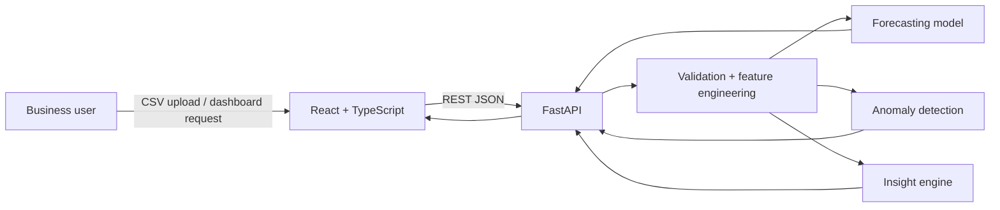

# Architecture

## Design decisions

- **React + TypeScript** keeps the dashboard strongly typed and recruiter-readable.
- **FastAPI** provides typed REST endpoints and automatic OpenAPI documentation.
- **Pandas / NumPy / scikit-learn** provide transparent analytics that can be inspected and tested.
- **Stateless CSV analysis** keeps the demo simple. A production evolution would persist organisations, users and trading records in PostgreSQL.
- **Docker** gives a reproducible local environment, while GitHub Actions validates backend tests and the frontend production build.

## Production roadmap

1. PostgreSQL + SQLAlchemy and migrations.
2. JWT/OAuth authentication and organisation-level tenancy.
3. Background ingestion jobs for POS/accounting integrations.
4. Forecast model evaluation and back-testing metrics.
5. AWS ECS/RDS deployment with Terraform.
6. Audit logging, rate limiting and observability.
